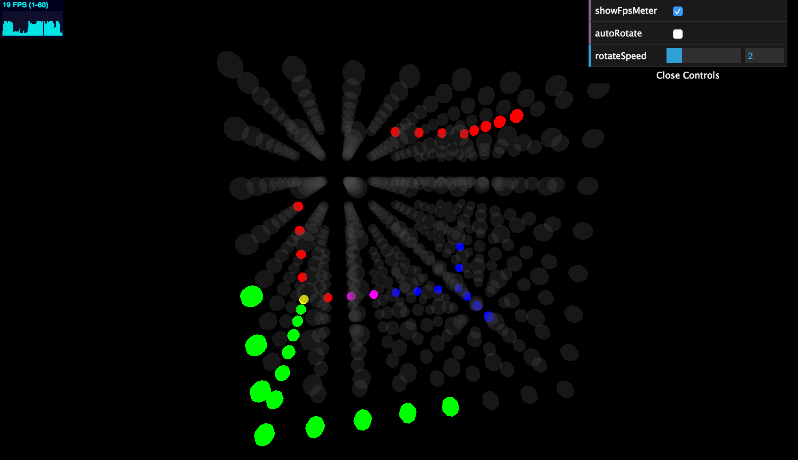

# LED Cube WebGL Simulator

This is a Node.js and WebGL-based simulator for the [LED cube code](https://github.com/pbrook/pycubedemo) by pbrook. It is in no way well-engineered and was thrown together in a hurry, so please don't judge!

This is what it looks like:

## How to run it

Dependencies: Node.js >= v0.10 (tested and works in Node 6.0.0), a WebGL-capable browser, and a decent CPU and GPU (as it's not particularly optimised)

* `npm install`
* `npm start`
* Visit localhost:8124 in a browser
* Run Python cube code, using `localhost:3000` for the port.

## How it works

Originally, the Python code exclusively communicated with the physical LED cube over a serial connection, but later a serial-over-TCP connection method was added so that the Python code could communicate with the physical cube over a network connection. This project simulates a physical LED cube, so it interprets the same serial protocol that was intended to power the physical LED cube. The Node.js process translates hardware-focussed messages (set pixel: board and offset, RGB colour) received over TCP into messages that are more appropriate for software (set pixel: xyz coordinates, RGB colour), which are sent over a Socket.io connection to connected browsers.

When the browser receives the messages over Socket.io, it handles graphics features such as double-buffering before displaying the coloured pixels on an LED cube simulated by Three.js.

## License

GPLv3